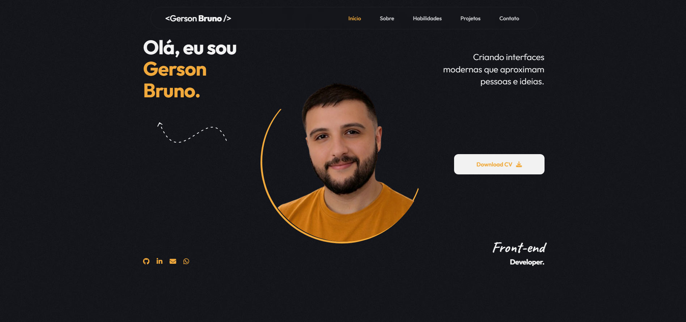

# 🌐 Portfólio — Gerson Bruno


Portfólio pessoal desenvolvido com **React + TypeScript** para apresentar projetos, habilidades e experiência como desenvolvedor Front-End. O site reúne trabalhos que vão desde aplicações com React e TypeScript até integrações com APIs externas, refletindo uma stack moderna e foco em experiência do usuário.

---

## 🔗 Acesse o site

**[gersonbruno.dev](https://www.gersonbruno.dev/)**

---

## 🖼 Preview



---

## 🚀 Tecnologias

| Tecnologia | Uso |
|---|---|
| React 18 | Biblioteca para construção da interface |
| TypeScript | Tipagem estática e robustez do código |
| CSS3 | Estilização modular com variáveis personalizadas |
| Lucide React / Font Awesome | Ícones vetoriais |
| Google Fonts | Tipografia (Outfit + Caveat) |
| Framer Motion | Animações fluidas |

---

## ⚙️ Funcionalidades

- 🌑 **Dark Mode nativo** com design focado em produtividade e conforto visual
- 📱 **Layout responsivo** para mobile, tablet e desktop
- ✨ **Animações de entrada** suaves com Framer Motion
- 🍔 **Menu mobile** com toggle animado
- 🗂 **Seção de projetos** com links para demo e código-fonte
- 🎨 **Noise Overlay** — textura sutil para visual mais orgânico
- 📜 **Scrollbar personalizada** integrada à identidade visual

---

## 🛠️ Diferenciais Técnicos

### 🔄 Refatoração: Vanilla → React + TypeScript

A transição para React permitiu a **componentização** total da interface, facilitando a reutilização de elementos como Botões, Cards de Projetos e Seções. A adoção do TypeScript trouxe:

- Auto-complete inteligente durante o desenvolvimento
- Detecção de erros em tempo de compilação
- Definição clara de `Interfaces` para as props de cada componente

---

## 📁 Estrutura do projeto

```
portfolio/
├── public/
├── src/
│   ├── components/
│   ├── assets/
│   │   └── img/
│   ├── styles/
│   │   └── global.css
│   ├── App.tsx
│   └── main.tsx
├── index.html
├── tsconfig.json
└── package.json
```

---

## 👨‍💻 Sobre o autor

Desenvolvedor Front-End com background na área da saúde (fisioterapia), o que traz um olhar analítico e centrado no usuário para cada projeto.  
Atualmente cursando **Análise e Desenvolvimento de Sistemas** pela UNINTER e participando da **Residência em TIC-12 (Trilha Full Stack)** pela UFC.

[](https://www.linkedin.com/in/gerson-bruno-baptista/)
[](https://github.com/gerson-bruno)