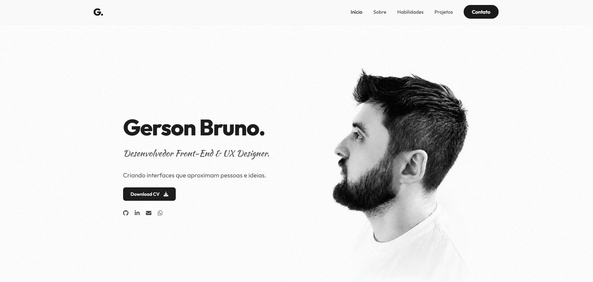

# Portfólio

Este é o meu portfólio pessoal, criado para apresentar alguns dos projetos que desenvolvi e as tecnologias que utilizo no desenvolvimento front-end.

A proposta do site é mostrar na prática meu trabalho com **HTML, CSS e JavaScript**, focando em interfaces modernas, responsivas e bem organizadas.

---

## 🌐 Acesse o projeto

🔗 **[Clique aqui para ver o site](http://gerson-bruno.github.io/portfolio/)**

---

## 🖼 Preview

---

## 🚀 Tecnologias utilizadas

- HTML5  
- CSS3  
- JavaScript  
- Font Awesome  
- Google Fonts  

---

## ⚙️ Funcionalidades

- Layout totalmente **responsivo**
- **Modo claro e escuro** com persistência no navegador
- **Animações de entrada** ao rolar a página
- **Menu mobile**
- Seção de **projetos com links para demonstração e código**

---

## 👨‍💻 Sobre

Este portfólio foi criado para reunir meus projetos e facilitar o compartilhamento do meu trabalho como desenvolvedor front-end.

A ideia é continuar evoluindo o projeto, adicionando novos trabalhos e melhorias conforme avanço nos estudos e na prática.

